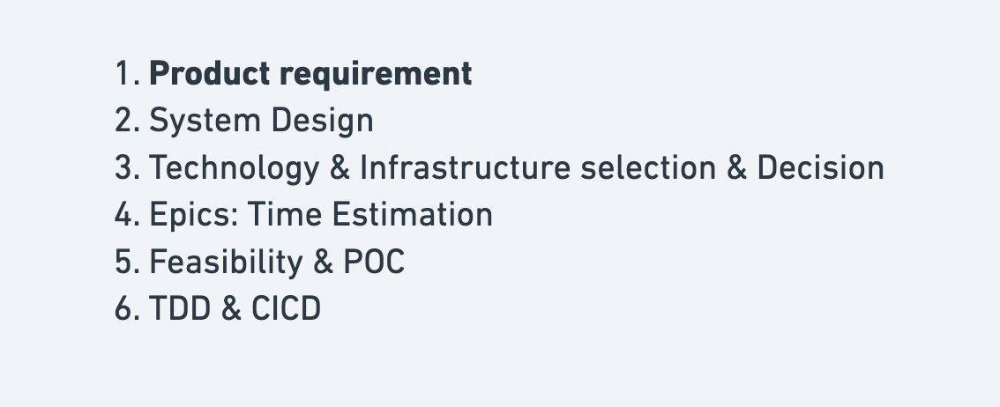
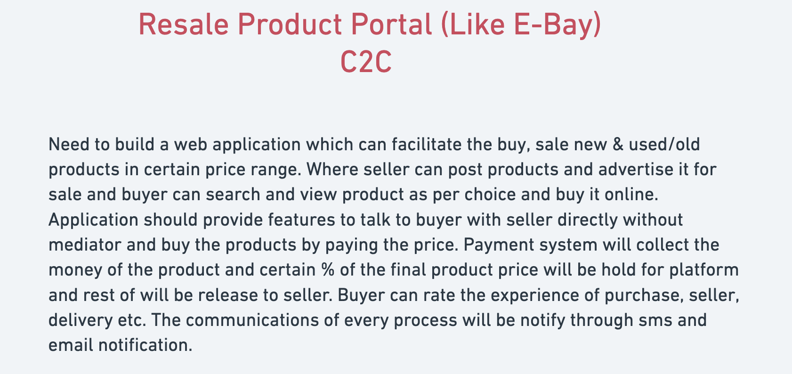
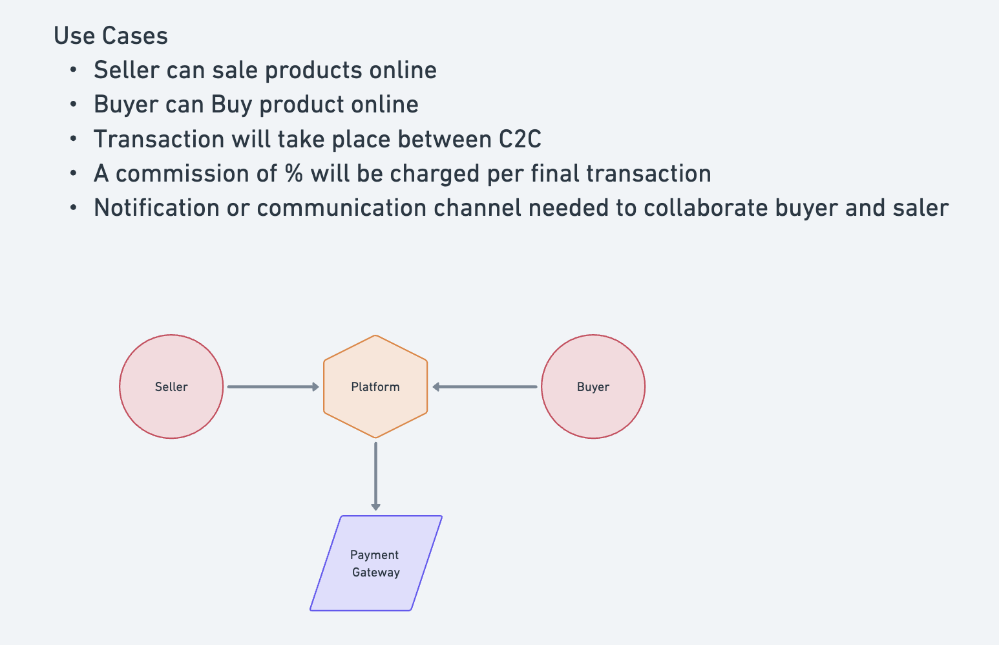
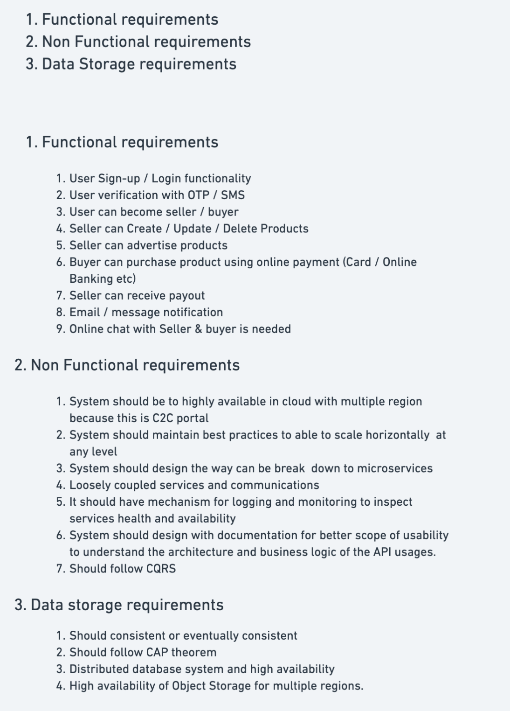
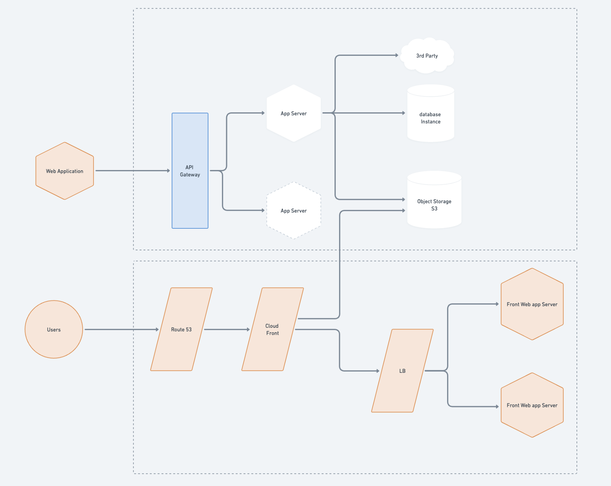
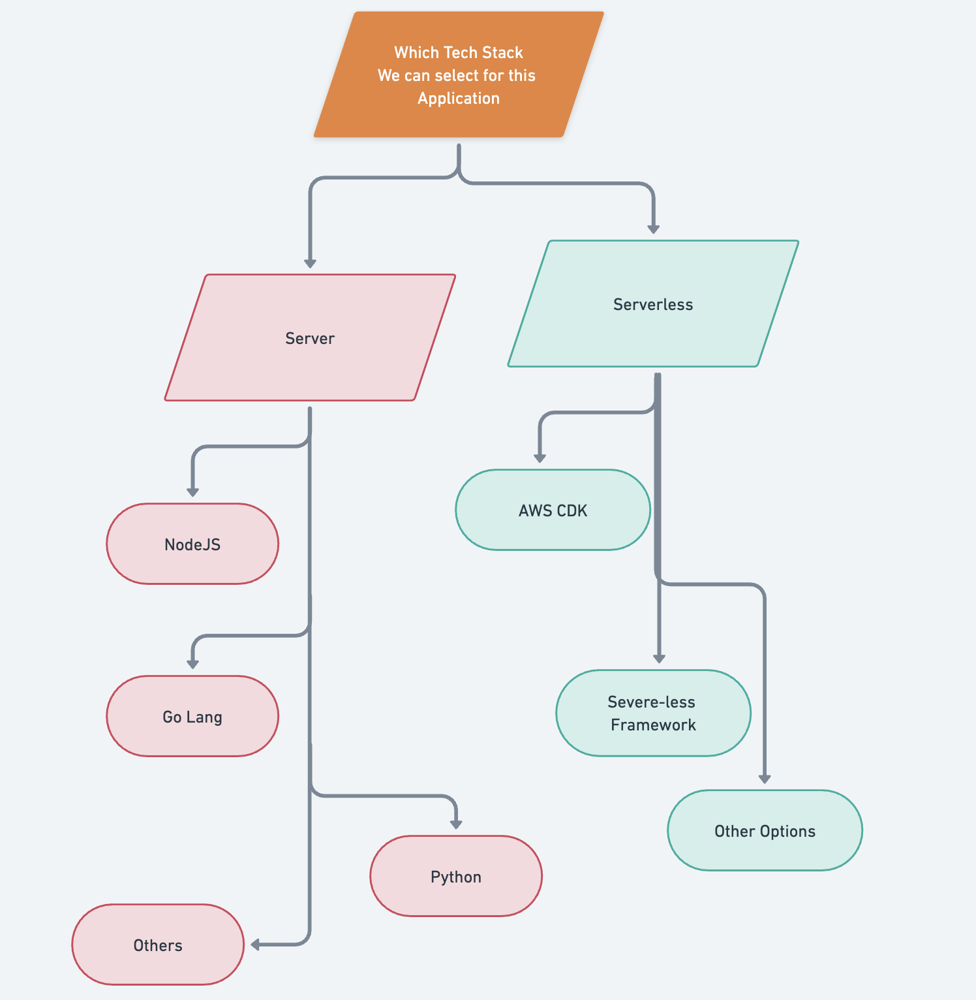
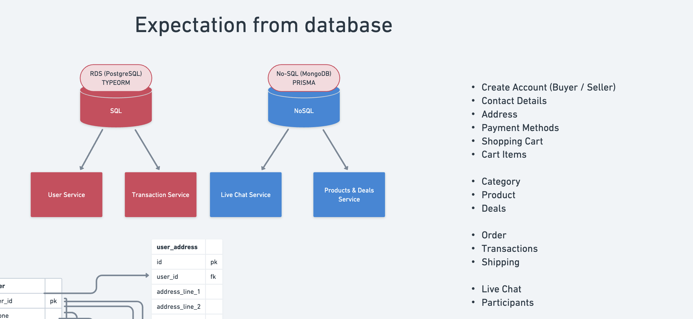
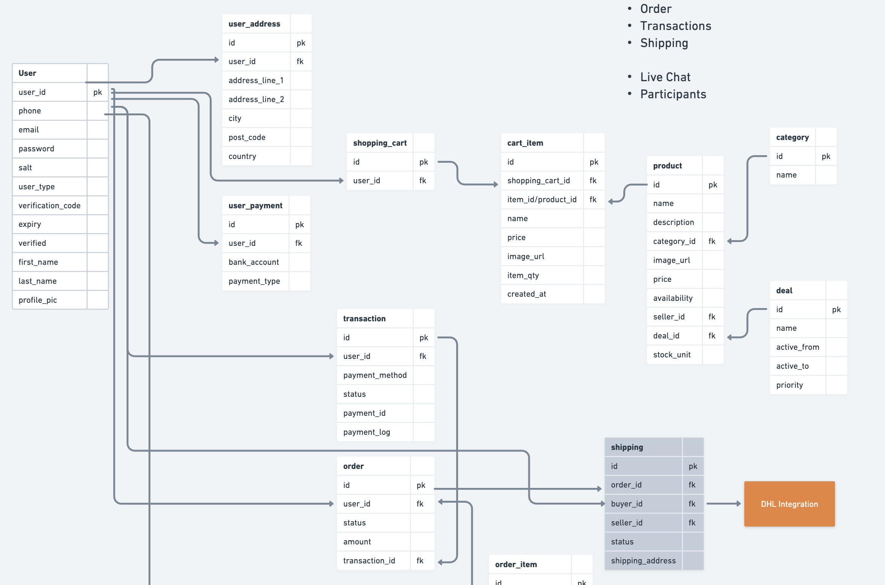

# microservice-nodejs-shopping-web

## Project Process

### Functional Requirements

### Use Cases

### System Design

### Basic Architecture

### Technical Design

### Application Structure

### Database Design

